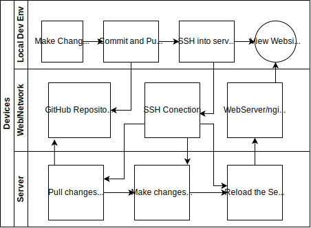
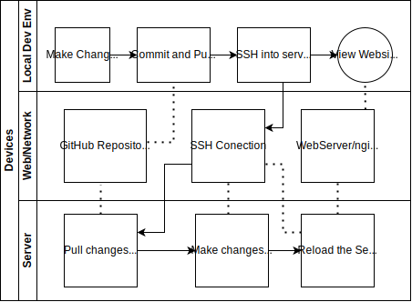

# The Idea, but only on my self-imposed terms

I've wanted to host my own website for a while now. 

It looked like a very fun project and the idea of actually **building** my own creative outlet seemed very rewarding. But mostly because I'm a nerd and having a website sounds cool and all the cool kids do it (I want to be a cool kid). 


Before we start, as a *FOSS enjoyer* that has once fallen into the trap of using all the latest web-frameworks and technologies on a previous project, I devised the following *guidelines*:

1. The server needs to be self-hosted
1. All the code and software fully open-source (apart from [GitHub](https://www.youtube.com/watch?v=Lp4C-x96XIo))
1. Using vanilla HTML and CSS, with as little JS as possible

Alright, with that out of the way, let's get into it!


# Setting up the Server

My initial plan was to repurpose my old laptop as a server. However, as fate would have it, it ended up passing away (R.I.P. Asus x550jk - gone too soon after 10 years of daily use). 

Now, I was left looking at other *cheap* alternatives such as an old Raspberry Pi. This got me thinking: "hey, aren't smartphones small, compact and use Arm chips as well?".

## You can't be serious

No, no, just hear me out. So I had this Android phone laying around and it just makes perfect sense for this use case:

- Cheap: it wasn't being used, which makes it free
- Low Power: the thing draws like 2.5W, that's 0.25€ a month
- Has an internet connection
- Can run Linux: sort of, not quite, but close enough
- Built-in backup battery: the router would not be on in that scenario, but still

Now, I can hear you loud and clear: "What about security?", "How cheap can you be?", "Isn't that thing a fire hazard?". Yes. All of that will be discussed in the 1 year aniversary post when I find out.

## Setting up Termux

While I'm sure flashing a true native Linux OS is possible, that skill transcends me yet. 

I went for the easy approach and installed [Termux](https://termux.dev/en/): "an Android terminal emulator and Linux environment app". 

It comes with it's own package manager which provides tons of packages for usefull software. The ones I used can be installed by running the following:

```bash
# ssh client
pkg install dropbear

# server
pkg install nginx

# for pulling the code from a GitHub reporitory
pkg install git
```

### SSH

The first thing I did was to get ssh up and running. After that is done the rest of the setup could be done from the confort of my computer.

We can use *dropbear* to start the ssh server on the server (i.e. the phone):

```bash
# with default port 22
dropbear

# defining a custum port
dropbear -p 'port'
```

And on the client side (i.e. my laptop), we can connect to it:

```bash
# connect to the ssh server from the local network
ssh user@server-local-ip -p 'port'
```

Great, now we don't need to touch the ~~phone~~ server anymore!

### NGINX

I'm not gonna delve too deep on how to configure nginx, but basically all the setup is done on a config file, usually in `/etc/nginx/nginx.conf`. It will look something like this:

```bash
http {
   . . .
    server {
        listen       PORT; #ssl if https certificate is needed
        server_name  www.example.com;

        ssl_certificate /path/to/certificate/location;
        ssl_certificate_key  /path/to/certificate/key/location;

        ssl_protocols TLSv1.2 TLSv1.3;
        ssl_ciphers HIGH:!aNULL:!MD5;

        location / {
            root  /path/to/website/root;
            index  index.html index.htm; #nginx will look for these files on the root
        }
        . . .
    }
}
```

For now, the important things to take care for are: the PORT, which is conventionally 80 for http requests (443 for https, but I'll get there in a bit); the root location with the path to our website directory.

After that we can start the server with:

```bash
# start the nginx server
nginx
```

Great, now the website should be accessible at `server-local-ip:port` on the browser!

## Connectig to the Internet

### Port Forwarding

Up until now I'd only been using the local network. However, since I wanted to access my server by ssh and for my site to be accessible from anywhere in the world I needed to configure port forwarding on my router. 

This means *connecting* our internal ip adress (our server-local-ip) and port number, which are only accessible on the local network, with an external ip and port number, connected to the whole internet. This can usually be done on the router config page, and every router's page is special and unique in it's own way, so it's no use trying to show the process.

Now the ssh server is available globally by:

```bash
# connect to the ssh server from the local network
ssh user@router-external-ip -p 'port'
```
And the website can be viewed at `router-external-ip:port` on the browser!

### Getting a Domain Name

Choosing a domain name took twice as long as all previous steps combined. I wanted something with my name, but short and with no initials. Unfortunately, joselopes.com was already taken and they wanted 8888$ for it (lmao). 

As you can see, ended up on [joselopes.dev](https://joselopes.dev) as it was pretty hip and pretty cheap.


### HTTPS with Nginx

One of the quirks of the .dev domains is that it [requires https](https://get.dev/). Luckily, my domain name broker provides free SSL certificates, all that is required is to download them and change the appropriate fields on the nginx.conf file. 

Also worth noting, the default port for https is 433, so it is recommended to forward that port in the router settings.


# Building the Website

It's finally time to build the website!

## Workflow and DevOps

It is a very simple workflow: make changes -> upload to GitHub -> pull from GitHub on the server -> reload server.

I tried my best to make a visual diagram:
<!--  -->



I'd love to automate this process further by integrating [GitHub actions](https://docs.github.com/en/actions) but couldn't get it to work on Termux :|

### Managing Development and Production nginx configs

A problem I encountered came down to managing the nginx.conf files.

I wanted to be able to modify my config file on my development environment and for those changes to be carried over to the server automatically (or within my current workflow).

However, this wasn't so simple because the config files on both ends were funcamentally different on: ports used, server name, https configuration. 

My solution came down to a template system where I inject the variables I need using a script and [envsubst](https://man.archlinux.org/man/core/gettext/envsubst.1.en#DESCRIPTION). 

This way, I can just change the template and it will work on both development and production sides! It also takes care of handling any secrets I don't want in my public GitHub repository.


## The frontend: deserved credits
 
As mentioned previously, I wanted something as simple and as portable as possible, with standard HTML and CSS. 

This allowed me to take a lot of inspiration from other developers to build components for this website.


- [The theme: Rosé Pine](https://rosepinetheme.com/) (my personal favourite, use it on everything)
- [Floating Squares Background by TokioWeb](https://codepen.io/tokyoweb/pen/ZjdYVj)
- [Sidebar Menu by Jelena Jovanovic](https://codepen.io/plavookac/pen/qomrMw)


## Writing in Markdown

Finally, html can be quite cumbersome for writing these long, article style types of posts.

I've been using a combination of markdown and [pandoc](https://pandoc.org/) for notetaking during my University lectures and found it to be quite an elegant way to quickly produce clean and consistently styled documents.

Inspired by this, I decided to adapt it to the context of this website and I think works great! I keep all my common elements like the header, side-bar, backgroud and footer on an HTML template file and write all of the content in markdown. 

This allows me flexibility when changing the overall style of my website (since I only need to modify one file) while keeping the content in purely a text-based, human friendly format.


# Final Remarks

---

This whole process has been incredibly rewarding.

I've learned quite a bit about Web-dev and for sure honed in on my developement skills. I'm honestly looking forward to keep my little self-hosting journey going. Make sure to checkout the whole website project on [GitHub](https://github.com/MIBismuth/personal-webpage).

It has been great being able to share my small (yet frequent) updates with friends and family.

And if feels even greater coming now to the end of my first post realizing I have so much more so share.


Thank you for reading,

--- José Duarte Lopes

---

